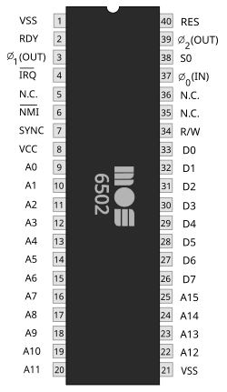
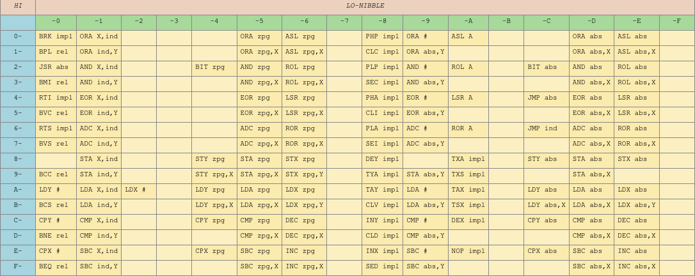

# MOS6502+ emulator on C++
This project is just emulator of MOS6502 CPU, but with some modifications from me.

## About MOS6502
The original MOS6502 is an 8-bit microprocessor that was launched in 1975. There are 56 instructions and 5 registers.

## About this project
The MOS6502+ is an implementation of original MOS6502 on C++, but with modifications. You can see all opcodes at the [documentation](./docs/Contents.md). The MOS6502+ has 64Kb of memory and 3 registers like the original CPU. As the project in development, whole emulator is at one file. At the future i'll rewrite it.

### Future Plans
- Compare instructions (CMP, CPY, CPX)
- Add/Subtract without carry (AWC, SBC)
- Bit test
- Interrupts
- Overflow flag

## Credits
- Basis of CPU was made due to [this video](https://youtu.be/qJgsuQoy9bc?si=Y3X__cbZj2t1EBB3).
- An instructions table i got from https://www.masswerk.at/6502/6502_instruction_set.html